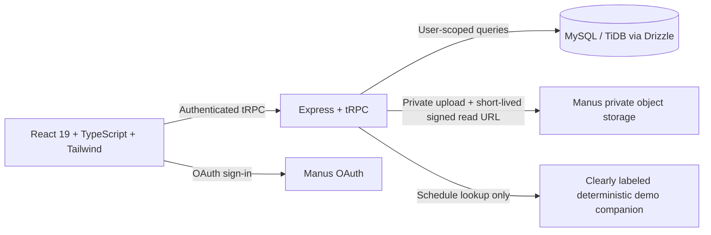

# We Care — Health & Wellbeing

A calm, accessible daily companion for people living with memory loss and their caregivers. We Care is a supportive organizing tool—not a diagnostic tool or replacement for professional care.

## Architecture



- **Frontend:** React, TypeScript, Tailwind CSS, Wouter routes, and the template's accessible UI components.
- **Backend:** Express + tRPC with Manus OAuth. Feature procedures require an authenticated user and filter records by that user's ID.
- **Persistence:** Drizzle ORM over MySQL/TiDB. User profiles, daily activities, and familiar-person details persist in separate tables.
- **Branding:** The supplied We Care wordmark is held in project storage and displayed by `client/src/components/BrandLockup.tsx`. The source archive includes a cropped `we-care-logo.jpg`; for a different deployment, upload it to that project's storage and update the component's storage path.
- **Photos:** Sent to the server only after the caregiver checks the consent acknowledgment; the server also enforces that acknowledgment, verifies JPEG/PNG/WebP byte signatures, and limits uploads to 5 MB after client-side resizing. Photos are stored in private object storage and referenced by a user-scoped key. The browser receives a short-lived signed URL only after an authenticated ownership check.
- **AI:** No external AI model is connected. The companion is explicitly in **demo mode**: its schedule answers are generated on the server from the signed-in user's saved activities, and it says when information is absent. It does not diagnose, recommend treatment, or invent appointments.
- **Recognition:** No face-recognition service/model is connected. The capture demonstration does not upload its image; it clearly reports uncertainty and provides manual browsing instead.

## Implemented features

- Welcoming landing page and resumable three-step onboarding.
- Personal daily overview, daily progress, quick links, and optional fictional sample data.
- Monthly calendar and agenda, date selection, activity create/edit/delete, completion, and reminders.
- **Past-day protection:** past dates are view-only in the UI and rejected by backend create/update/delete/complete rules using the profile's IANA time zone. Rescheduling a past activity is rejected even if its destination is in the future.
- Familiar-person profiles with name, relationship, description, device camera or file selection, photo preview/replace/remove, photo-consent acknowledgement, private upload, and caregiver-only edits.
- Truthful manual recognition fallback; no claim of face identity.
- Schedule-aware demo companion, repeated answers via text-to-speech, stop/restart control, configurable speech rate, and optional browser speech input.
- Tap-to-dictate for profile, activity, and familiar-person text fields on browsers that support Web Speech recognition; spoken text appends to existing text, and typing remains available. Audio processing and permissions are controlled by the user's browser/device, not this app.
- Browser notification permission flow and foreground reminders with duplicate suppression. No background push service is configured.
- Caregiver/support-person interface view, help, privacy explanation, and preference settings.
- Sample records are tagged as demo data; reset removes only those tagged sample activities/people, not user-created records. Editing or completing a sample converts it to a user-owned record so a later reset will keep that work.

## Run locally

Requirements: Node.js 22+, pnpm, and a MySQL/TiDB database. Use [`ENVIRONMENT.md`](./ENVIRONMENT.md) as the placeholder reference when configuring private local environment variables. Never commit `.env` or real credentials.

```bash
pnpm install
pnpm db:push
pnpm dev
```

Open `http://localhost:3000`. Configure the OAuth provider's allowed callback URL for your local and deployed origins (the application callback is `/api/oauth/callback`). The full-stack template supplies the auth, database, and storage helpers; local work requires corresponding credentials/URLs.

The first signed-in user completes onboarding. Load the fictional sample day from **Today → Demo samples** for a quick walkthrough; **Reset demo samples** removes only those examples.

### Environment variables

The placeholder configuration is documented in [`ENVIRONMENT.md`](./ENVIRONMENT.md). In a managed WebDev project, database, OAuth, and Manus storage credentials are injected by the platform. For a self-managed run, configure:

- `DATABASE_URL` — MySQL/TiDB connection string.
- `JWT_SECRET` — strong random session-signing secret.
- `VITE_APP_ID`, `OAUTH_SERVER_URL`, `VITE_OAUTH_PORTAL_URL` — Manus OAuth application settings.
- `BUILT_IN_FORGE_API_URL`, `BUILT_IN_FORGE_API_KEY` — server-side private photo storage access.
- `OWNER_OPEN_ID`, `OWNER_NAME` — template owner identity settings, if required by your environment.

No AI API key is currently required or used. Do not place server credentials in `VITE_*` variables.

## Tests and build

```bash
pnpm check
pnpm test
pnpm build
```

Automated tests cover local-time date boundaries, date validation, cross-month/year date arithmetic, schedule-grounded answers, empty schedules, medical-question redirection, and the template logout behavior.

## Deployment

1. Create/configure the managed WebDev environment for this project and set the server-side environment variables above; use a production database and the platform's private object storage.
2. Apply the generated Drizzle migration in `drizzle/` to the target database. The development project database has already received the initial schema migration.
3. Configure OAuth redirect URLs for the deployed domain, including `/api/oauth/callback`.
4. Run `pnpm check`, `pnpm test`, and `pnpm build`.
5. Save a project checkpoint, then use the project's **Publish** action in the WebDev management interface. Autoscale hosting is sufficient; the app has no always-on worker.
6. Open the deployed site, sign in, and verify the onboarding, schedule, and photo workflows against the production storage/database configuration.

## Known limitations / real-device checks

- English is the only supported interface and speech language.
- The companion is deterministic demo behavior, not a connected generative model. Configure and validate a secure server-side model before describing it as connected AI.
- Familiar-person recognition is not available until a separately selected, consented, privacy-reviewed recognition provider/model is configured. Current results never claim identity.
- Browser notifications are foreground-only and depend on browser permission. Do not rely on this app for urgent or medication-critical alerts.
- Camera capture, microphone input, speech synthesis, and notification behavior require device/browser testing; some browsers require HTTPS. The camera and file input have fallback paths, but permissions vary by device.
- This demo supports one signed-in account per private care space. It does not yet implement caregiver invitations or sharing between separate accounts.
- The platform storage helper does not expose object deletion. Removing a person removes the database association; an already-uploaded, now-unreferenced object may remain in storage until managed by the storage platform's retention process.
- This application is a hackathon demonstration and has not undergone clinical, legal, or security certification.
